Title: Ribbon plot cell lineage to GEP
Date: 2023-07-17
Category: Human project
Summary: Assign T cell lineages to GEPs
Tags: scRNAseq, effector programs

[TOC]

# 1. Context
The hypothesis is that every T cell lineage (CD4, CD8, etc.) doesn't end up equally in any effector program in PBMCs. For example, MAITs are more likely to belong to GEP1 (Th1/Th17 program).

The challenge is to find a robust method to "assign" each cell to a GEP.

# 2. Assigning PBMCs to GEPs

## 2.1. Method 1: assign cells to GEP with highest score
For each cell, we have a "score" for each GEP, which represents the average expression level of all GEP genes, to which is substracted the average expression level of equal nb of random control genes.

For each cell:
1. Assign cell to GEP with highest score
2. Define cells with a negative highest score to be "undefined"

Result:
- 7 cells unassigned out of 41,238
- GEP1:  12,224 cells
- GEP4:  10,559 cells
- GEP5:  16,913 cells
- GEP6:  1,422 cells
- GEP8:  34 cells
- GEP11: 13 cells
- GEP12: 66 cells

Difference between highest GEP score and 2nd highest:
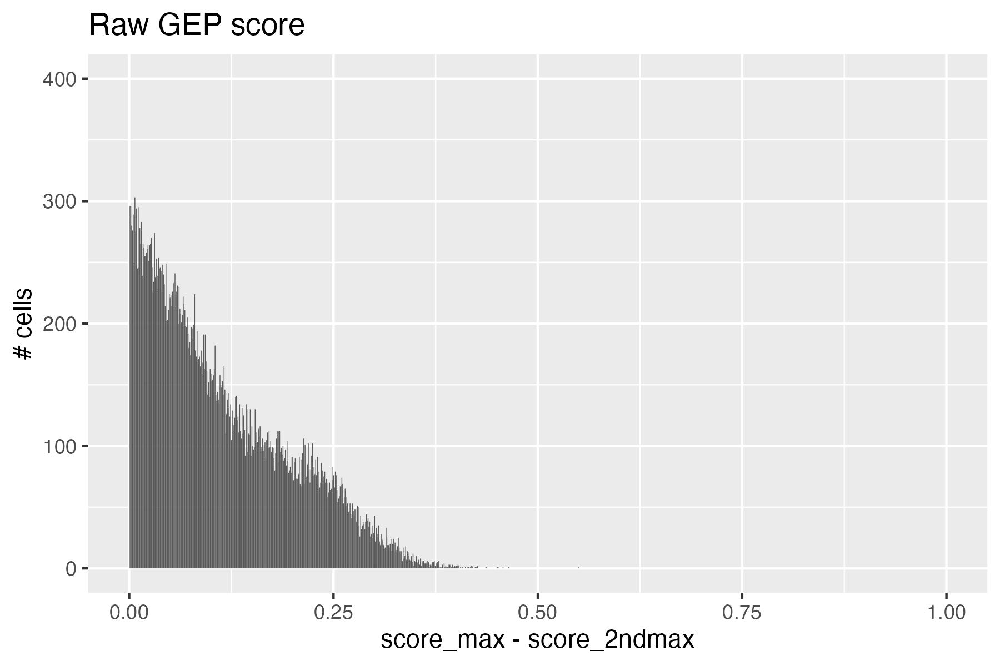

UMAP:
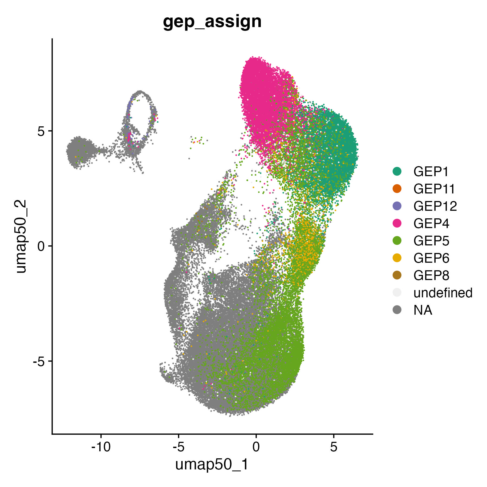

 

## 2.2. Method 2: normalize GEP scores and assign cells to GEP with highest normalized score
Pros: makes sure that GEPs are on the same scale
Cons: it "forces" GEPs with lower values (especially with a lot of negative values like GEP11, GEP12) to become positive, so it artificially shifts lower expressed GEPs to be as high as higher expressed GEPs.

## 2.3. Method 3: compute z-score of GEP scores and assign cells to GEP with highest z-score
Cons: same as method 2, artificially increases the value of lower expressed GEPs, and decreases value of higher expressed GEPs => more or less equal number of cells assigned to every GEP

## 2.4. Method 4: assign cells to GEP with highest %max score
For each cell:
1. Remove GEPs with negative score
2. Divide score by max score in each gep (%max)
3. Create new columns with GEP with highest score & GEP with 2nd highest score
4. Assign cell to GEP with highest score (if there is at least a 0.01 score difference)

Result:
- 1,089 cells unassigned out of 41,238
- GEP1:  12,589 cells
- GEP4:  9,355 cells
- GEP5:  14,674 cells
- GEP6:  2,948 cells
- GEP8:  230 cells
- GEP11: 298 cells
- GEP12: 48 cells

Difference between highest GEP score and 2nd highest:
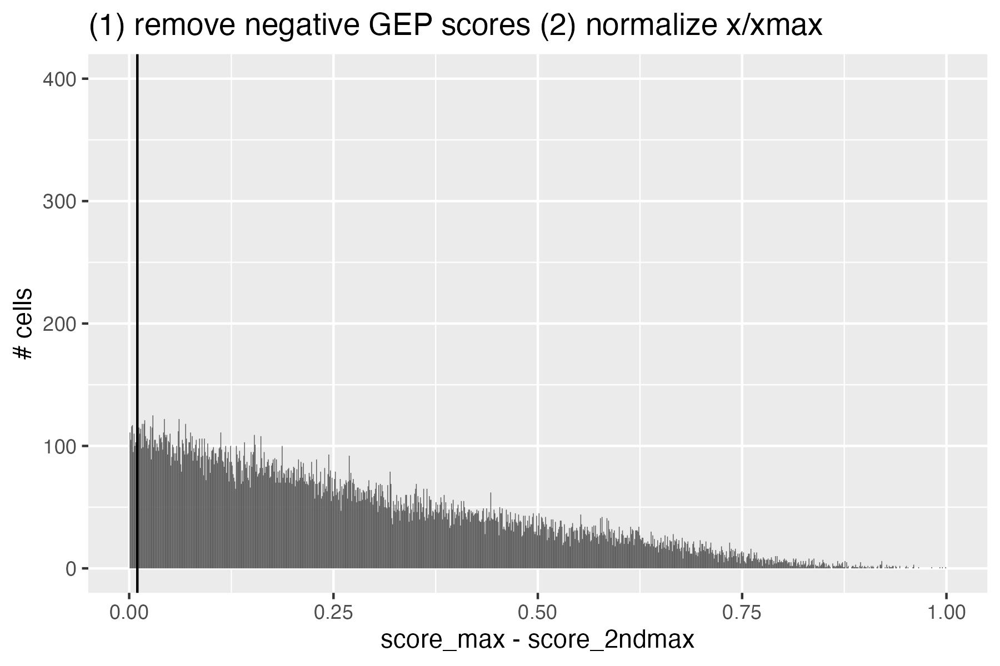

Normalized GEP scores & the cells GEP assignment:
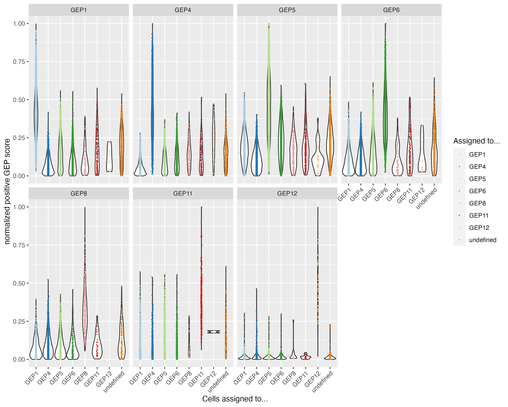

UMAP:
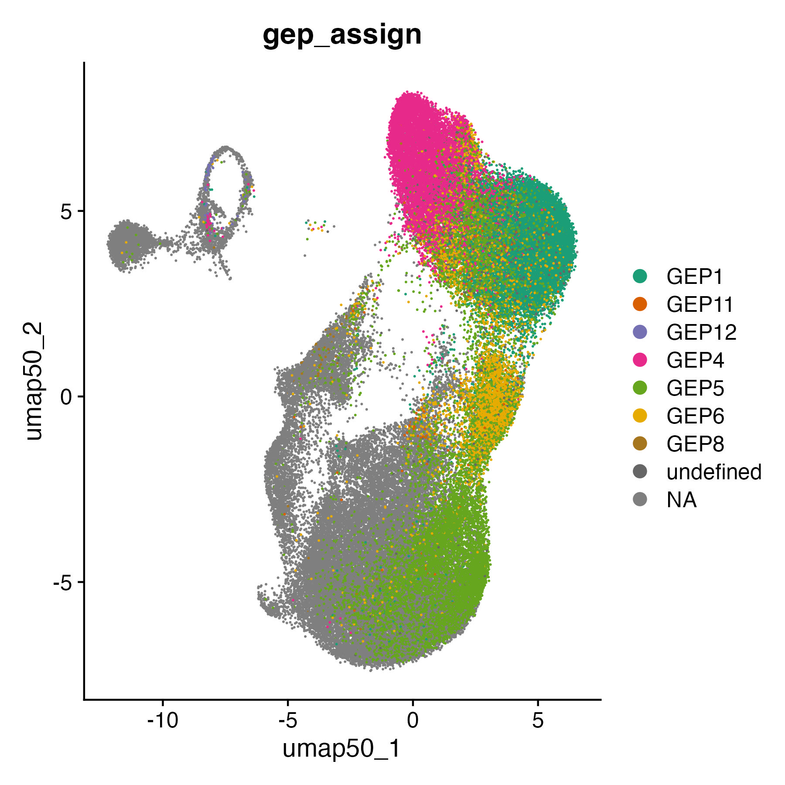

End result ("others" corresponds to GEP8-12 and undefined):
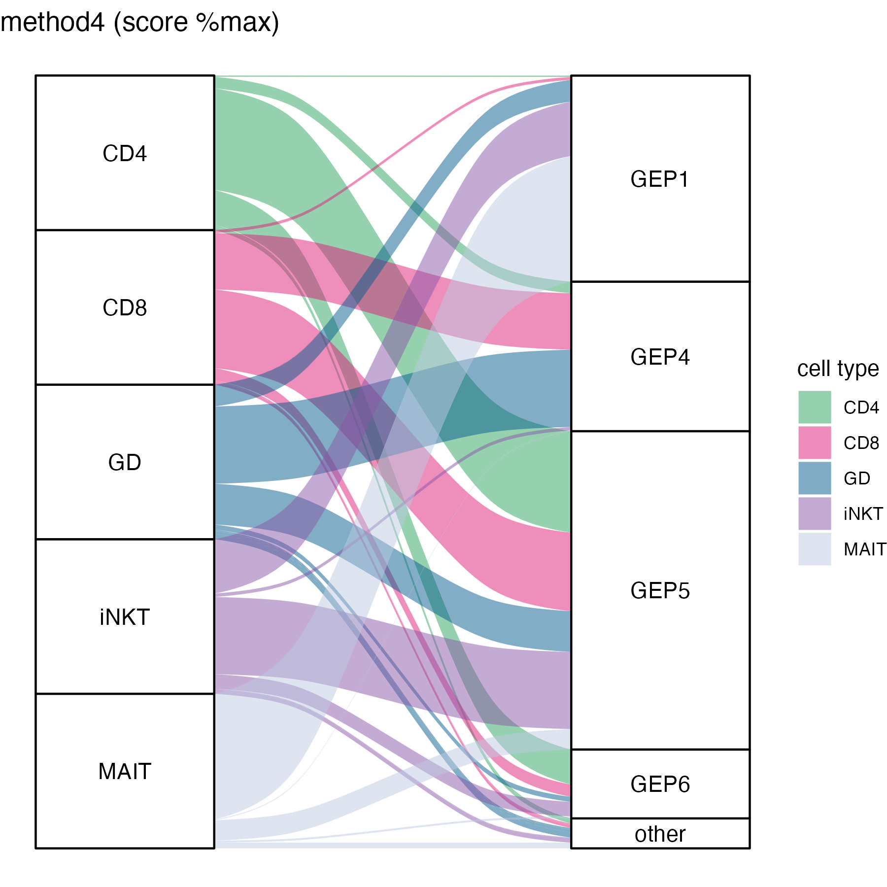

 

## 2.5. Method 4bis: assign cells based on %max score distribution
For each cell:
1. Remove GEPs with negative score
2. Divide score by max score in each gep (%max)
3. Look at "normalized" score distribution:

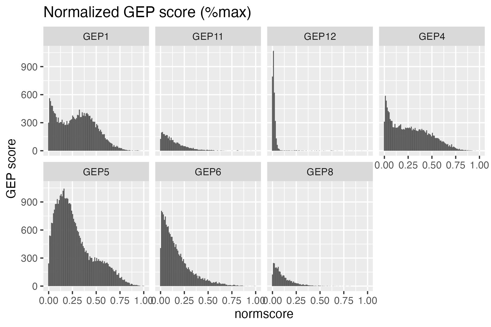

4. Assign cells to a GEP based on thresholds:
- GEP1>0.2
- GEP4>0.2
- GEP5>0.35
- GEP5>0.35
- GEP8>0.4
- GEP11>0.4
- GEP12>0.1

5. Keep only cells that have been assigned to 1 GEP

Result:
- 10,178 cells unassigned out of 41,238
- GEP1:  12,302 cells
- GEP4:  8,694 cells
- GEP5:  8,854 cells
- GEP6:  1,081 cells
- GEP8:  42 cells
- GEP11: 42 cells
- GEP12: 35 cells

UMAP:
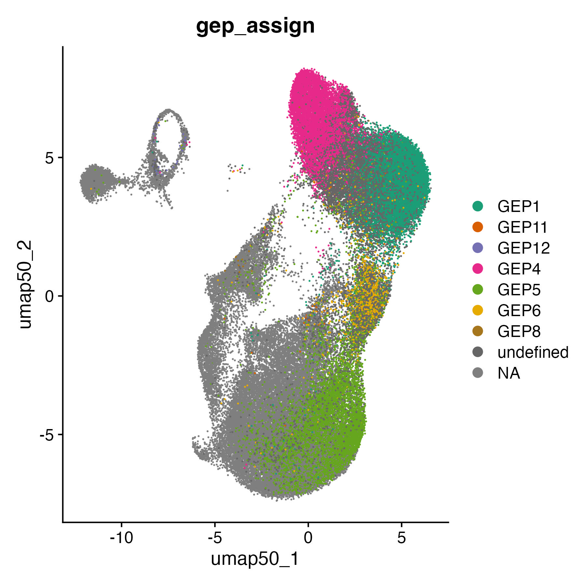

End result ("others" corresponds to GEP8-12 and undefined):
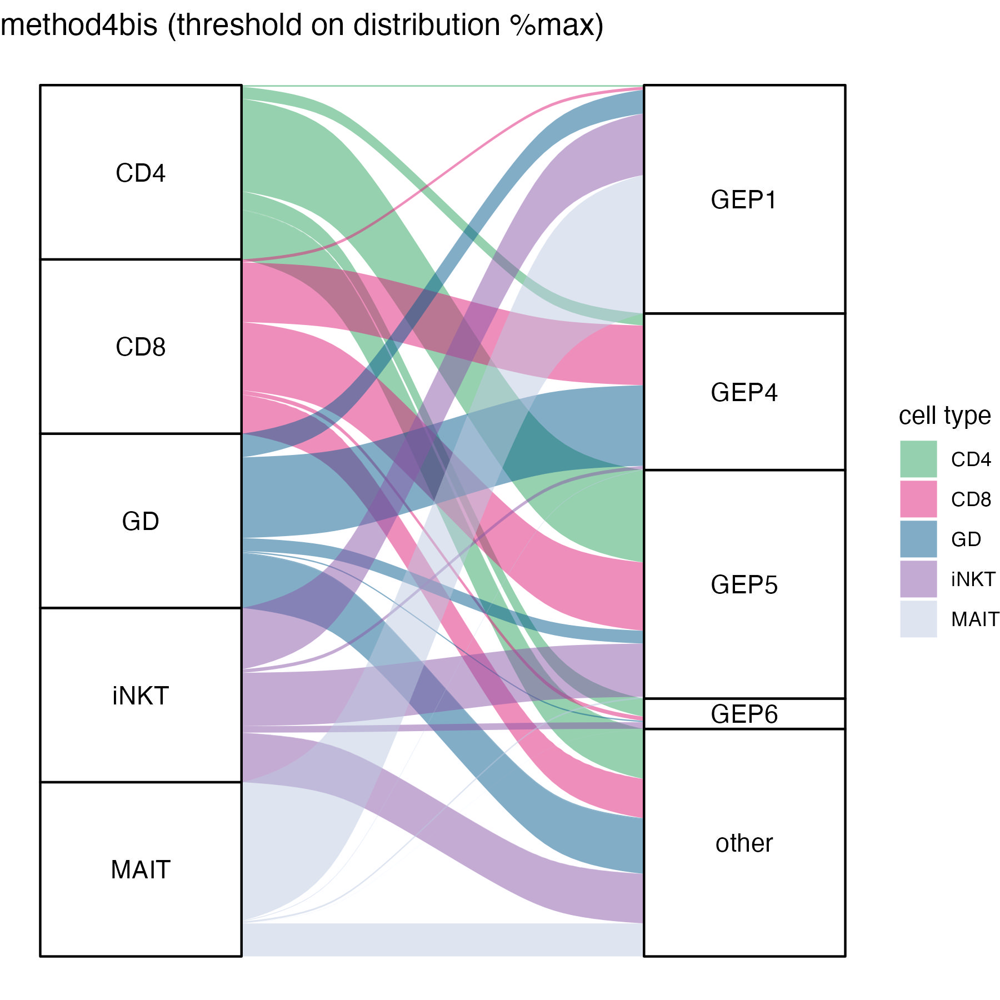

 

## 2.6. Method 6: compute GEP gene enrichment with AUCell
AUCell will order the genes by expression level in each cell, and then draw a recovery curve based on the # genes from each GEP that are found in the top x% highest expressed genes (default 5%). The more GEP genes are found in the top 5% of the cell, the highest the AUC:

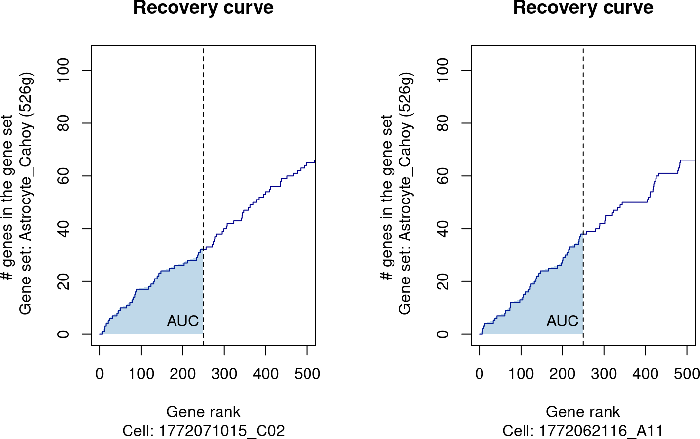

Challenge: each GEP has a very different number of genes:

- GEP1 504
- GEP4 830
- GEP5 1309
- GEP6 950
- GEP8 2346
- GEP11 1778
- GEP12 1702

So if we look at the enrichment of GEP genes within the top 5% of expressed genes (aka 861 genes), at most GEP1 can only have 504 genes found in these top 861 genes (whereas other GEPs can have more genes in there, so higher AUC).

Thresholds assignment:
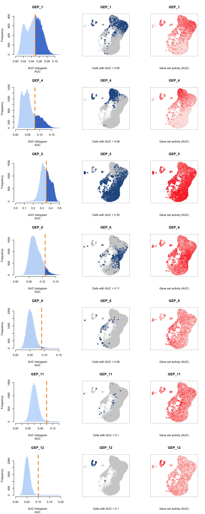

The problem is that only ~37,000 cells are assigned, and ~21,000 of them are assigned to 2 or more GEPs...

We can't assign cells to the GEP with highest AUC, because GEP5 is higher than every other GEP. Thinking about it, we can't do that, because if GEP5 happens to contain more genes that are (globally) more highly expressed than GEP6 for instance, then cells will be automatically assigned to GEP5 all the time (that's the whole point of having control genes from same expression bin during scoring).

