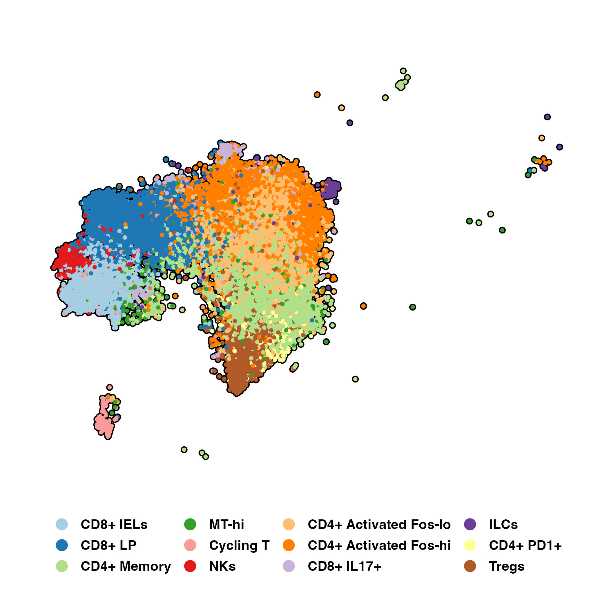
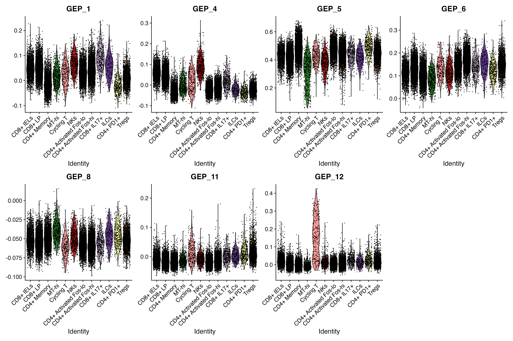
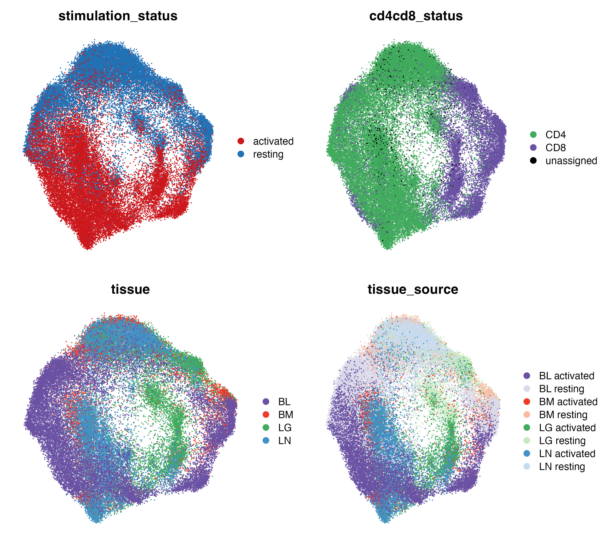
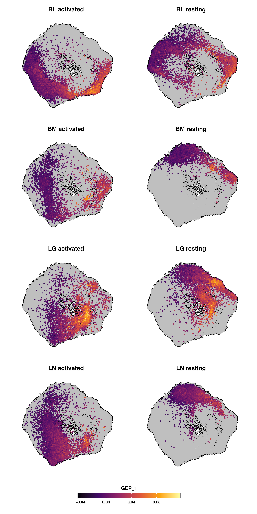
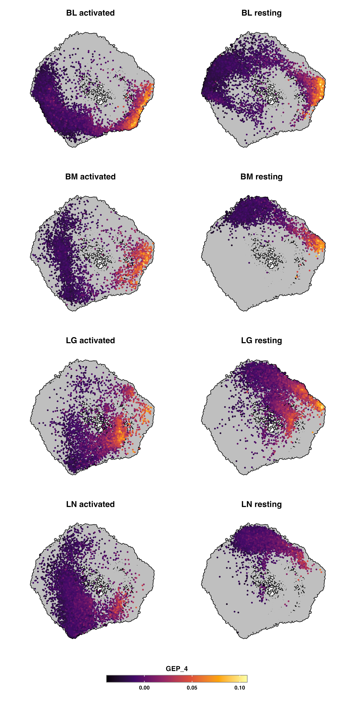
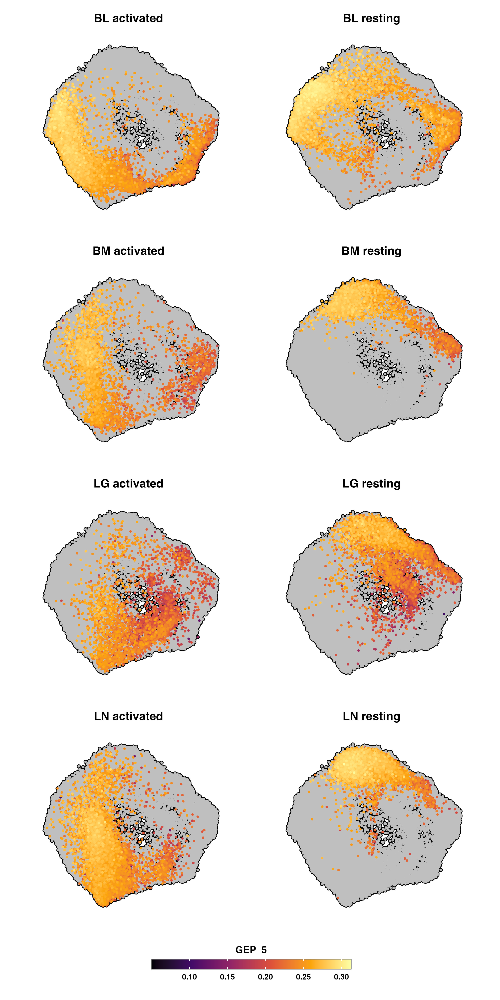
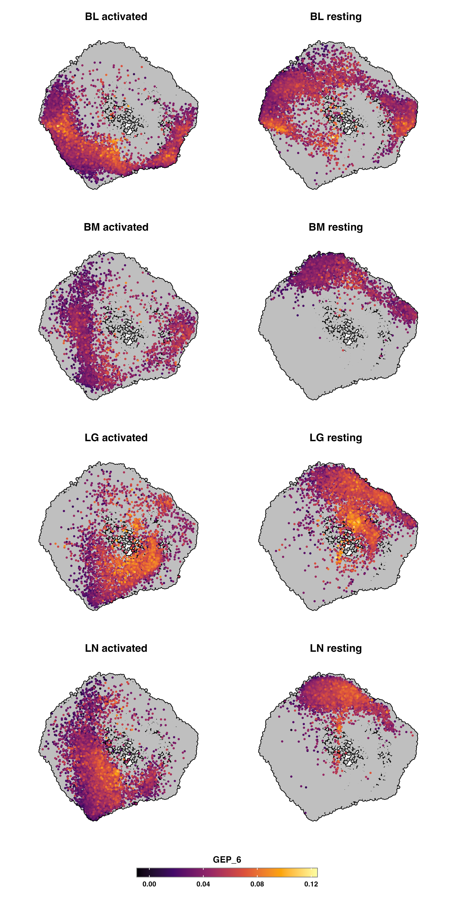
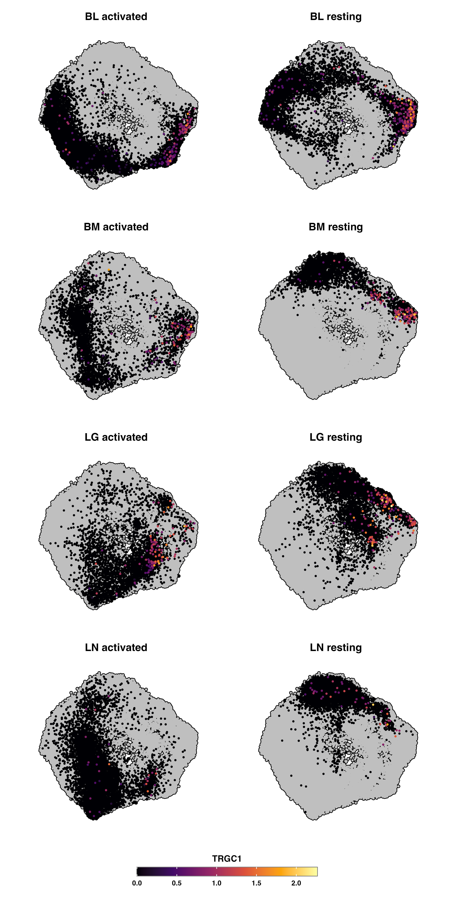

Title: Apply GEPs to disease datasets
Date: 2023-07-28
Category: Human project
Summary: Score GEPs on disease datasets
Tags: scRNAseq, effector programs

[TOC]

# 1. Context
We believe that T cells fall into one of 3 effector programs in PBMCs:
- Tcm (GEP6)
- Th1/Th17 (GEP1), more MAIT specific
- Temra (GEP4)

The question is whether these programs are found in disease context

 

# 2. Smillie et al. - Ulcerative Colitis

Paper: [Intra- and Inter-cellular Rewiring of the Human Colon during Ulcerative Colitis](https://www.sciencedirect.com/science/article/pii/S0092867419307329?via%3Dihub)
Data: https://data.humancellatlas.org/explore/projects/cd61771b-661a-4e19-b269-6e5d95350de6

Data from 68 biopsies of colonoscopy from 18 UC patients and 12 HC. From UC patients they took both some non-inflamed ("normal") and inflamed/ulcerated tissue.

I subsetted the data only to T-cells (could not reproduce their T-sne in fig1C):

I scored the GEPs of interest on the Smillie dataset & ours, because not all GEP genes were found in Smillie data:
- GEP1: 423/504 genes
- GEP4: 677/830 genes
- GEP5: 971/1,309 genes
- GEP6: 692/950 genes
- GEP8: 1,801/2,346 genes
- GEP11: 1,472/1,778 genes
- GEP12: 1,484/1,702 genes

To note, I included GEP11 because there are some Tregs in the Smillie dataset.
GEPs scored on dimension reductions:

It's hard to see anything, so let's take a look at it on violin plots:

- GEP1: higher in CD8+ cells, mostly _CD8+ IL17+_, _ILCs_, _CD8+ IELs_, _CD8+ LP_ (lamina propria)
- GEP4: higher in NKs ++
- GEP5: higher in _CD4+ Memory_, _CD4+ Activated Fos-lo/hi_, _ILCs_
- GEP6: higher in _CD4+ Activated Fos-hi_?
- GEP8: non existent
- GEP11: higher in some _Cycling T_ and _Tregs_
- GEP12: clearly higher in _Cycling T_

To note, there is TRGC1 and TRGC2 expression in some _CD8+ IELs_ and _CD8+ LP_, so there are probably some GDT cells in there.

Are there differences by disease state?

- _CD8+ IELs_ are decreased in inflamed tissue, while _CD8+ LP_ seem increased. There isn't much difference in GEPs, aside from GEP5 increased in non-inflammed tissue in _CD8+ LP_
- _CD4+ memory_ are increased in UC patients (inflamed or not). The uninflammed have higher GEP5 score (naive).
- _CD8+ IL17+_ cells expanded in UC (also notified by the paper, which they found "surprising")

 

# 3. Szabo et al. - Tissue and activation signatures in health and disease

Paper: [Single-cell transcriptomics of human T cells reveals tissue and activation signatures in health and disease](https://www.nature.com/articles/s41467-019-12464-3)

Data from T cells from lung, lung lymph nodes, bone marrow, blood. CD3+ T cells isolated from tissues and were cultured in media alone ("resting") or in the presence of anti-CD3+CD28 antibodies ("activated") for 16h. Blood samples come from live healthy donors (donor 1 and 2) and the other tissue samples come from deceased healthy donors (donor A and B).

Data from: https://cellxgene.cziscience.com/collections/24d42e5e-ce6d-45ff-a66b-a3b3b715deaf

I included all of their T cell data (like Fig.6):

I had to translate the ENSEMBL IDs to gene symbols. A lot of gene symbols were duplicated, but only 2 of the duplicated ones were part of the GEPs (PINX1, GOLGA8M), so I discarded all of the duplicated gene symbols.

I scored the GEPs of interest on the Szabo dataset & ours, because not all GEP genes were found in Szabo data:
- GEP1: 463/504 genes
- GEP4: 715/830 genes
- GEP5: 1,057/1,309 genes
- GEP6: 789/950 genes
- GEP8: 1,950/2,346 genes
- GEP11: 1,575/1,778 genes
- GEP12: 1,544/1,702 genes

GEPs scored on dimension reductions:

It's hard to see anything, so let's take a look at it on violin plots:

- vast majority of the cells are clearly naïve (prob because they didn't enrich for innate T cells)
- doesn't really look like there is an increase in cells that are GEP1, GEP4 or GEP6 after stimulation
- LNs only contain GEP5 (and maybe some GEP6?), which is likely consistent with GEPs we scored on Poon dataset 
- GEP12 goes up ++ with activation (cells are proliferating then)

To note, some GDs are hiding in there (and prob some MAITs):
