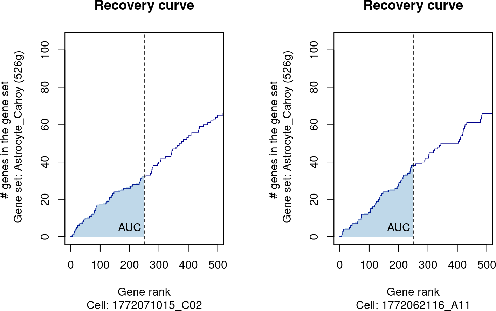
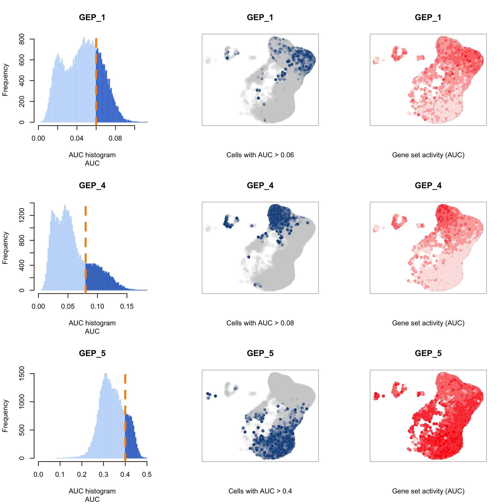
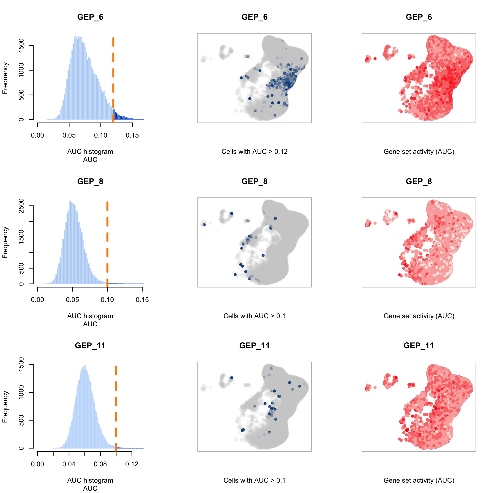
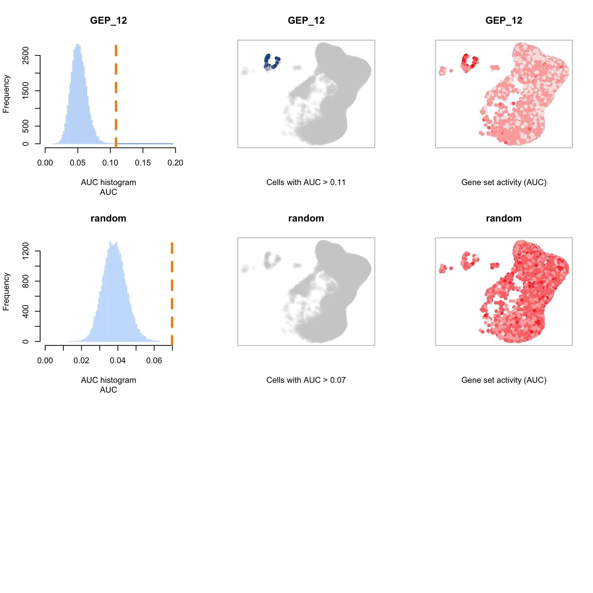

Title: Ribbon plot cell lineage to GEP
Date: 2023-07-17
Category: Human project
Summary: Assign T cell lineages to GEPs
Tags: scRNAseq, effector programs

[TOC]

# 1. Context
The hypothesis is that every T cell lineage (CD4, CD8, etc.) doesn't end up equally in any effector program in PBMCs. For example, MAITs are more likely to belong to GEP1 (Th1/Th17 program).

The challenge is to find a robust method to "assign" each cell to a GEP.

# 2. Assigning PBMCs to GEPs

## 2.1. Method 1: assign cells to GEP with highest score
For each cell, we have a "score" for each GEP, which represents the average expression level of the top 200 GEP genes, to which is substracted the average expression level of random 200 control genes.

...

## 2.2. Method 2: normalize GEP scores and assign cells to GEP with highest normalized score
Pros: makes sure that GEPs are on the same scale
Cons: it "forces" GEPs with lower values (especially with a lot of negative values like GEP11, GEP12) to become positive, so it artificially shifts lower expressed GEPs to be as high as higher expressed GEPs.

## 2.3. Method 3: compute z-score of GEP scores and assign cells to GEP with highest z-score
Cons: same as method 2, artificially increases the value of lower expressed GEPs, and decreases value of higher expressed GEPs => more or less equal number of cells assigned to every GEP

## 2.4. Method 4: assign cells to GEP with highest %max score
...

## 2.5. Method 5: compute GEP gene enrichment with AUCell
AUCell will order the genes by expression level in each cell, and then draw a recovery curve based on the # genes from each GEP that are found in the top x% highest expressed genes (default 5%). The more GEP genes are found in the top 5% of the cell, the highest the AUC:

Challenge: each GEP has a very different number of genes:

- GEP1 504
- GEP4 830
- GEP5 1309
- GEP6 950
- GEP8 2346
- GEP11 1778
- GEP12 1702

So if we look at the enrichment of GEP genes within the top 5% of expressed genes (aka 861 genes), at most GEP1 can only have 504 genes found in these top 861 genes (whereas other GEPs can have more genes in there, so higher AUC).

Thresholds assignment:

